# Outline

::: columns
:::::: {.column width=60%}

1. Ancestral Recombination Graphs (ARGs)
2. Tree sequences: storage and computation
3. Variational dating of ARGs
4. Application: pathogenic variants

::::::
:::::: {.column width=60%}

::: {.fragment .floatright}
{width=60%}

[tskit.dev](https://tskit.dev)
:::

:::::: 
::: 

<!--
Abstract: The Ancestral Recombination Graph (or, ARG) is a way of representing all ancestral relationships
between a collection of recombining genomes. It can be viewed as a collection of trees along the genome
or as a set of inheritance relationships between modern and ancestral haplotypes. If known, it gives
a more natural and informative way to summarize genetic variation: for instance, by providing ages and
inheritance patterns of the mutations that led to modern variants. In this talk I will summarize recent
progress in estimating whole-genome ARGs, including from Biobank-scale datasets, and describe how this
way of representing data leads to orders-of-magnitude improvements in storage and computation. I will also
describe a (variational) Bayesian method for estimating the times of events in a given ARG, leading to
substantial improvements in dating accuracy. Using the new method on ARGs estimated from 50,000 whole genomes,
I will show that inferred dates are more informative about SNP pathogenicity than allele frequency.
This is one example of how ARGs provide a way to summarize genetic variation without relying on
the more usual problematic and inaccurate division into "populations".
-->

<!--
title-slide-attributes:
    data-background-image: /path/to/title_image.png
    data-background-size: contain
-->

--------------------

> UO is located on the traditional indigenous homeland of the Kalapuya people.
Kalapuya people were dispossessed of their indigenous homeland by the United States government and forcibly removed.
Today, Kalapuya descendants are primarily citizens of the Confederated Tribes of Grand Ronde and the Confederated Tribes of Siletz Indians,
and continue to make important contributions to their communities, to the UO, to Oregon, and to the world.

# What's an ARG?

## Genomes

> - are very big ($10^7$--$10^{12}$ nucleotides)
> - encode the basic *mechanisms* of life
> - reflect past *history* and *process*

. . .

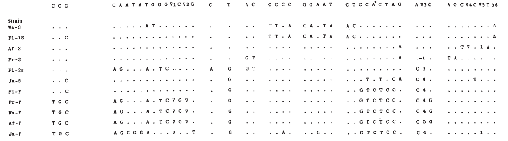

## Meiosis & Recombination

::: {.columns}
::::::: {.column width=50%}

:::
::::::: {.column width=50%}

- You have two copies of each chromosome, 
  one from each parent.

- When you make a gamete, the copies *recombine*, at Poisson($\rho$) locations.

- *Mutations* appear at Poisson($\mu$) locations.

:::
::::::

## What is an ARG?

For a set of sampled chromosomes,
an ARG describes
at each position along the genome the genealogical tree
that says how they are related.

## What is an ARG?

::: columns
:::::: {.column width=30%}

Better, in some ways, is to think of an ARG
as a set of relationships between haplotypes.

::: fragment
An ARG, broadly, is a graph-like structure
that tells us how a set of sampled chromosomes
are related to each other,
along a recombining genome.
:::

::::::
:::::: {.column .centered}

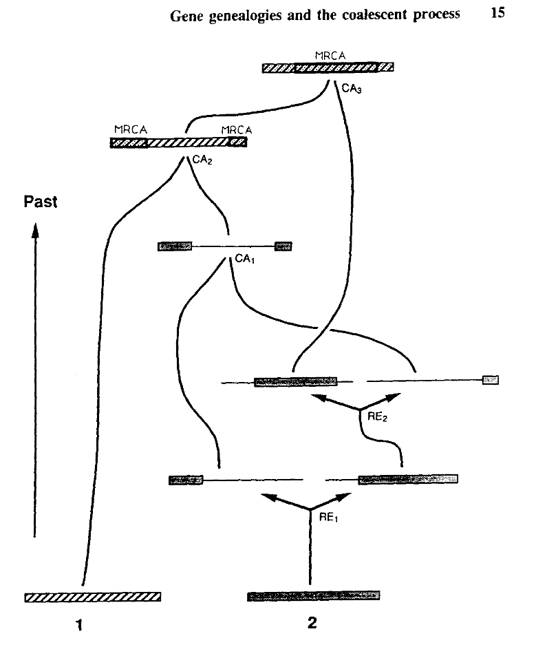{width=60%}

::::::
:::

# ARG inference: a quick overview

------------

<!-- see lit/notes.md -->

::: {.columns}
:::::: {.column width=50%}

ARG/coalescent theory:

::: incremental
- [Hudson 1983, 1991](https://www.sciencedirect.com/science/article/abs/pii/0040580983900138)
- [Griffiths & Tavaré 1994](https://doi.org/https:%2f%2fdoi.org%2f10.1006%2ftpbi.1994.1023)
- [Griffiths & Marjoram 1997](https://www.bibsonomy.org/bibtex/2d60d21cbcdf8d4328d26446b0ea3bee8/peter.ralph)
:::

::: fragment
Parsimony:
dozens of samples, dozens of SNPs:
:::

::: incremental
- [Hudson & Kaplan 1985](https://doi.org/10.1093/genetics/111.1.147)
- [Hein 1990](https://www.sciencedirect.com/science/article/abs/pii/002555649090123G)
- [Myers & Griffiths 2003](https://dx.doi.org/10.1093/genetics/163.1.375)
- [Song & Hein 2005](https://doi.org/10.1089/cmb.2005.12.147)
- [Song, Wu & Gusfeld 2005](https://doi.org/10.1093/bioinformatics/bti1033)
- [Minichello & Durbin 2006](https://pubmed.ncbi.nlm.nih.gov/17033967/)
:::

::::::
:::::: {.column width=50%}

::: fragment
Full likelihood: integrating over possible ARGs;
dozens of samples, a few dozen SNPs:
:::

::: incremental
- [Griffiths & Marjoram 1996](https://www.liebertpub.com/doi/abs/10.1089/cmb.1996.3.479)
- [Kuhner, Yamato & Felsenstein 2000](https://academic.oup.com/genetics/article/156/3/1393/6051663)
- [Nielsen 2000](https://academic.oup.com/genetics/article/154/2/931/6047972)
- [Fearnhead & Donnelly 2001](https://academic.oup.com/genetics/article/159/3/1299/6049673)
- [Stephens and Donnelly 2002](https://doi.org/https:%2f%2fdoi.org%2f10.1111%2f1467-9868.00254)
- ARGweaver [(Rasmussen et al 2014)](https://journals.plos.org/plosgenetics/article?id=10.1371/journal.pgen.1004342)
    MCMC; dozens of samples for *megabases*
:::

::: fragment
"Modern" methods (whole chromosomes!):
:::

::: incremental
- Relate [(Speidel et al 2019)](https://doi.org/10.1038%2fs41588-019-0484-x)
    local tree building + reconciliation; $n \sim 10^3$
- tsinfer [(Kelleher et al 2019)](https://doi.org/10.1038%2fs41588-019-0483-y)
    haplotype matching; $n \sim 10^5$
- ARG-needle [(Zhang et al 2023)](https://doi.org/10.1038%2fs41588-023-01379-x)
    haplotype matching + [ASMC](https://palamaralab.github.io/software/asmc/); $n \sim 10^5$
- Singer [(Deng, Nielsen & Song 2024)](https://doi.org/10.1101%2f2024.03.16.585351)
    MCMC with full likelihood; $n \sim 10^2$
:::

::::::
:::

--------------

::: {.r-stack .centered}

{width=50%}

::::: fragment
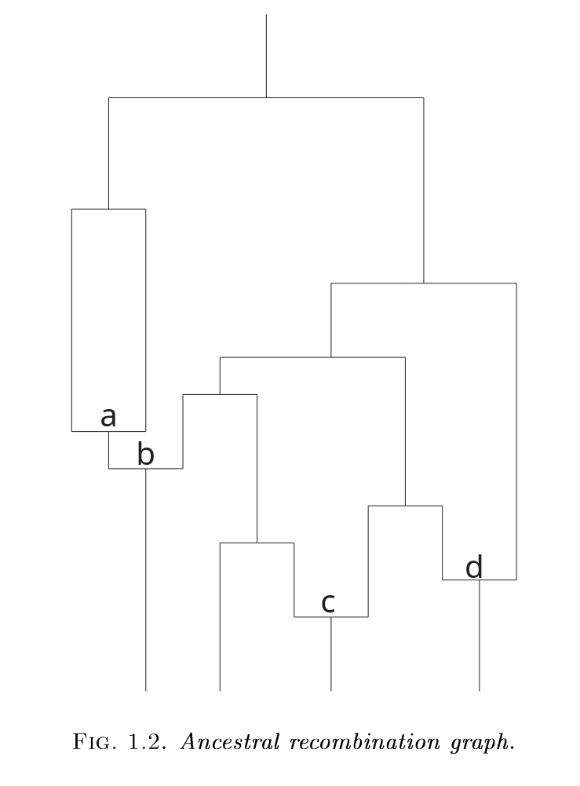{width=50%}
:::::

::::: fragment
{width=60%}
:::::

::::: fragment
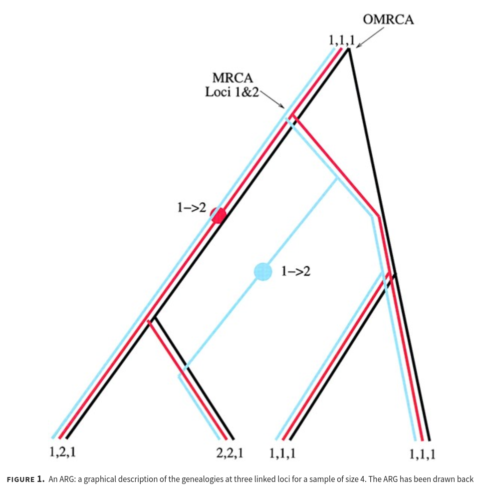{width=50%}
:::::

::::: fragment
{width=80%}
:::::

::::: fragment
{width=60%}
:::::

::::: fragment
{width=80%}
:::::

::::: fragment
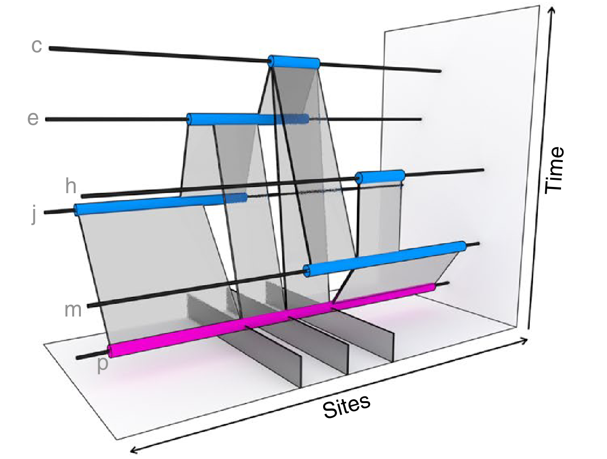{width=70%}
:::::

:::

---------

::: {.caption}
from [Wong et al 2024, *Genetics*](https://academic.oup.com/genetics/article/228/1/iyae100/7714980)
:::

<!-- Tree sequences: storage and computation -->

# Storage and computation

::: floatright
{width=40%}
:::

-------------

One way to view an ARG is as a sequence of genealogical trees
(with many nodes shared between adjacent trees).

. . .

----------------------

The **succinct tree sequence**

::: {.floatright}
is a way to succinctly describe this, er, sequence of trees

*and* the resulting genome sequences.

:::: {.caption}
[Kelleher, Etheridge, & McVean](http://journals.plos.org/ploscompbiol/article?id=10.1371/journal.pcbi.1004842) 
::::

:::

. . .

:::::: {.column width=50%}

{width=80%}

::::::
:::::: {.column width=50%}

::: {.floatright}
{width=50%}

:::: {.caption}
jerome kelleher
::::

:::

::::::

## Example: three samples; two trees; two variant sites

## Nodes and edges

Edges 

:   Who inherits from who.

    Records: interval (left, right); parent node; child node.

Nodes 

:   The ancestors those happen in.

    Records: time ago (of birth); ID (implicit).

-------------------

-------------------

-------------------

-------------------

-------------------

-------------------

-------------------

## Sites and mutations

Mutations

:   When state changes along the tree.

    Records: site it occured at; node it occurred in; derived state.

Sites 

:   Where mutations fall on the genome.

    Records: genomic position; ancestral (root) state; ID (implicit).

------------------

------------------

------------------

------------------

------------------

------------------

**The result:**
an encoding of the genomes *and* all the genealogical trees.

::: {.centered}

:::

<!-- # How's it work? -->

## File sizes

::: {.centered}
{width=90%}
:::

::: {.caption}
100Mb chromosomes;
from [Kelleher et al 2018, *Inferring whole-genome histories in large population datasets*](https://www.nature.com/articles/s41588-019-0483-y), Nature Genetics
:::

<!-- Estimated sizes of files required to store the genetic variation data for a
simulated human-like chromosome (100 megabases) for up to 10 billion haploid
(5 billion diploid) samples. Simulations were run for 10 1 up to 10 7 haplotypes
using msprime [Kelleher et al., 2016], and the sizes of the resulting files plotted
(points). -->

---------------

---------------

---------------

## For $N$ samples genotyped at $M$ sites

::: {.columns}
::::::: {.column width=50%}

*Genotype matrix*:

$N \times M$ things.

:::
::::::: {.column width=50%}

*Tree sequence:*

- $2N-2$ edges for the first tree
- $\sim 4$ edges per each of $T$ trees
- $M$ mutations

$O(N + T + M)$ things

:::
:::::::

{width=60%}

<!-- # Summarizing genomes and genealogies -->

## Fast genotype statistics

::: {.centered}
{width=70%}
:::

::: {.caption}
from [R., Thornton and Kelleher 2019, *Efficiently summarizing relationships in large samples*](https://academic.oup.com/genetics/article/215/3/779/5930459), Genetics
:::

## Summaries of genotypes and genealogies

::: {.columns}
:::::: {.column width=47%}

*Genotypes:*

1. For each site,
2. look at who has which alleles,
3. and add a *summary* of these values to our running total.

*Example:*
genetic distance
counts how many mutations differ between two sequences.

:::
:::::: {.column width=5%}

:::
:::::: {.column width=47%}

:::
::::::

## Summaries of genotypes and genealogies

::: {.columns}
:::::: {.column width=47%}

*Trees:*

1. For each branch,
2. look at who would inherit mutations on that branch,
3. and add the *expected contribution* to the running total.

*Example:*
the mean time to most recent common ancestor between two sequences.

:::
:::::: {.column width=5%}

:::
:::::: {.column width=47%}

:::
::::::

##

Given

1. a *weight* $w_i \in \mathbb{R}^n$ for each *sample node*, and
2. a *summary function* $f : \mathbb{R}^n \to \mathbb{R}$,

. . .

the **Site** statistic 
$$\begin{equation}
 \text{Site}(f,w) = \sum_{i: \text{sites}} \sum_{a: \text{alleles}_i} f(w_a)
\end{equation}$$
is the total summarized weights of all mutations,

. . .

and the **Branch** statistic 
$$\begin{equation}
 \text{Branch}(f,w) = \sum_{T: \text{trees}} s_T \sum_{b: \text{branches}_T} f(w_b) \ell_b
\end{equation}$$
is the *expected value* of $\text{Site}(f,w)$ under Poisson(1) mutation, given the trees.

## 

With genealogies *fixed*, and averaging only over *mutations* with rate $\mu$,
$$\begin{equation}
    \text{Branch}(f, w) = \frac{1}{\mu} \mathbb{E}\left[ \text{Site}(f, w) \vert T \right] .
\end{equation}$$

. . .

Dealing directly with genealogies
removes the layer of noise due to mutation:
$$\begin{equation}
    \frac{1}{\mu^2} \text{var}\left[\text{Site}(f,w)\right]
    =
    \text{var}\left[\text{Branch}(f,w)\right]
    +
    \frac{1}{n}
    \mathbb{E}\left[\text{Branch}(f^2,w)\right]
\end{equation}$$

. . .

and might produce *unbiased* estimates from ascertained genotype data.

::: {.caption .greyed .floatright}
also see R., TPB, 2019
:::

## 

:::: {.columns}
:::::::: {.column width=60%}

{width=100%}

:::
:::::::: {.column width=40%}

Duality, on 1000 Genomes data? Not quite...

- variation in mutation rate?
- biased gene conversion?
- selection?
- inference artifacts?

::: {.caption}
*Tree sequence from [Speidel et al 2019](https://www.nature.com/articles/s41588-019-0484-x).*
:::

:::
::::::::

# The tree sequence as a sparse matrix

*Problem:* given a $N \times M$ genotype matrix $G$ (of 0/1s)
and a $M$-vector $v$, compute $Gv$.

. . .

If $v_j$ is the additive effect of SNP $j$,
then $(Gv)_i$ is the genetic value of chromosome $i$.

## Matrix multiplication

*Problem:* compute $G1$, the number of mutations that each genome carries.

::: r-stack

:::: fragment

::::

:::: fragment
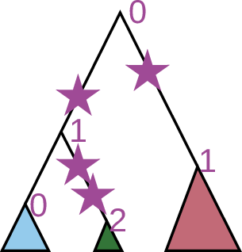
::::

:::: fragment

::::

:::: fragment

::::

:::: fragment

::::

:::: fragment
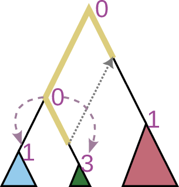
::::

:::: fragment
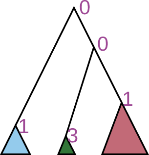
::::

:::: fragment
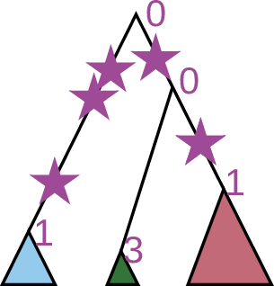
::::

:::: fragment

::::

:::: fragment

::::

:::: fragment
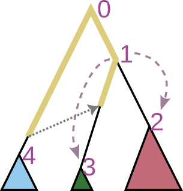
::::

:::: fragment

::::

:::

-------

::: columns
:::::: column
*Naive complexity:* $O(NM)$

*Tree sequence:* $O(N + M + T)$

::: fragment
Similar: relatedness matrix-vector product
(used in GWAS, genomic prediction, etc).
:::

:::::::
::::::: {.column .centered}

:::::::
:::

# Application: pathogenic variants

## {data-background-image="figs/gel-rare-diseases.png" data-background-position=center data-background-size=100%}

## the [UK 100,000 Genomes project](https://www.genomicsengland.co.uk/initiatives/100000-genomes-project)

::: columns
:::::: {.column width=65%}
{width=30%}
{width=30%}
{width=30%}
{width=30%}
{width=30%}
{width=30%}
:::::: 
:::::: {.column width=35%}
{width=60%}

Sam Tallman

Yan Wong

Ben Jeffery

Jerome Kelleher

Duncan Mbuli-Robertson

Nate Pope

::: fragment
*slides in part due to Sam Tallman*
:::

:::::: 
::: 

## The 100,000 Genomes Project

::: columns
:::::: {.column width=60%}

- UK initiative to sequence 100,000 genomes from 85,000 NHS patients
    and family members affected by rare disease or cancer.

- 71,800 participants (probands and family members) across over 190 rare diseases,
    none with genetic diagnoses prior to recruitment.

- Since 2018, over 6,000 genetic diagnoses

:::::: 
:::::: {.column width=40%}

{width=90%}

:::::: 
::: 

## Motivation: penetrant, pathogenic variants usually rare

::: centered
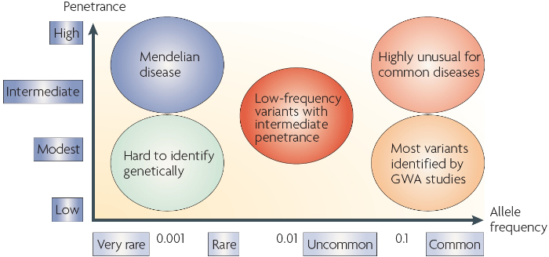
:::

::: caption
[Nykamp et al. 2017](https://www.nature.com/articles/gim201737)
:::

## But: datasets are notoriously unbalanced

::: columns
:::::: {.columns width=50%}

::::: fragment
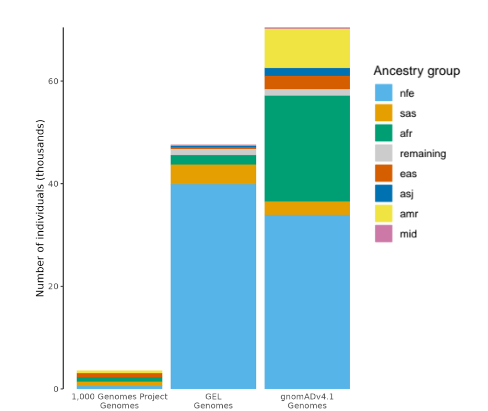{width=80%}

::: caption
Sam Tallman
:::
:::::

:::::: 
:::::: {.columns width=50%}

:::: fragment

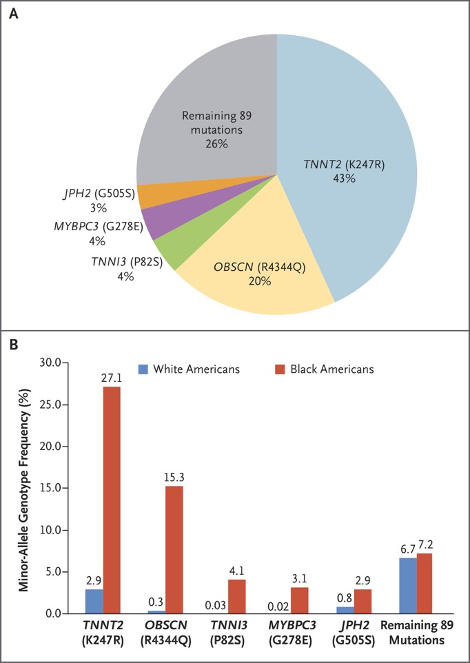{width=100%}

::: caption
[Manrai et al 2016](https://www.nejm.org/doi/pdf/10.1056/NEJMsa1507092),
*Genetic Misdiagnoses and the Potential for Health Disparities*
:::

::::

:::::: 
::: 

## What about age? {data-background-image="figs/folks/yan_wong.jpg" data-background-position="bottom 50px right 50px" data-background-size=10%}

::: r-stack

:::: fragment
{width=90%}
::::

:::: fragment
{width=90%}
::::

:::

# Variational dating: tsdate 0.2

::: centered
{width=30%}
:::

::: floatright
{width=50%}
:::

::: {.caption .floatright}
Nate Pope
:::

## Dating an ARG

::: columns
::::::: {.column width=50%}

*Given* an ARG with:

- nodes $\mathcal{N}$
- edges $\mathcal{E} \subset \{i \to j : i, j \in \mathcal{N}\}$
- mutation counts per edge $\{y_{ij} : ij \in \mathcal{E}\}$
- *sample* nodes with known time

*Infer:*

- times $\{t_i\}$ of remaining nodes
- satisfying the constraints $\{t_i < t_j : i \to j \in \mathcal{E}\}$

:::::::
::::::: {.column width=50%}

:::: r-stack

::: fragment

:::

::: fragment

:::

::: fragment

:::

::: fragment
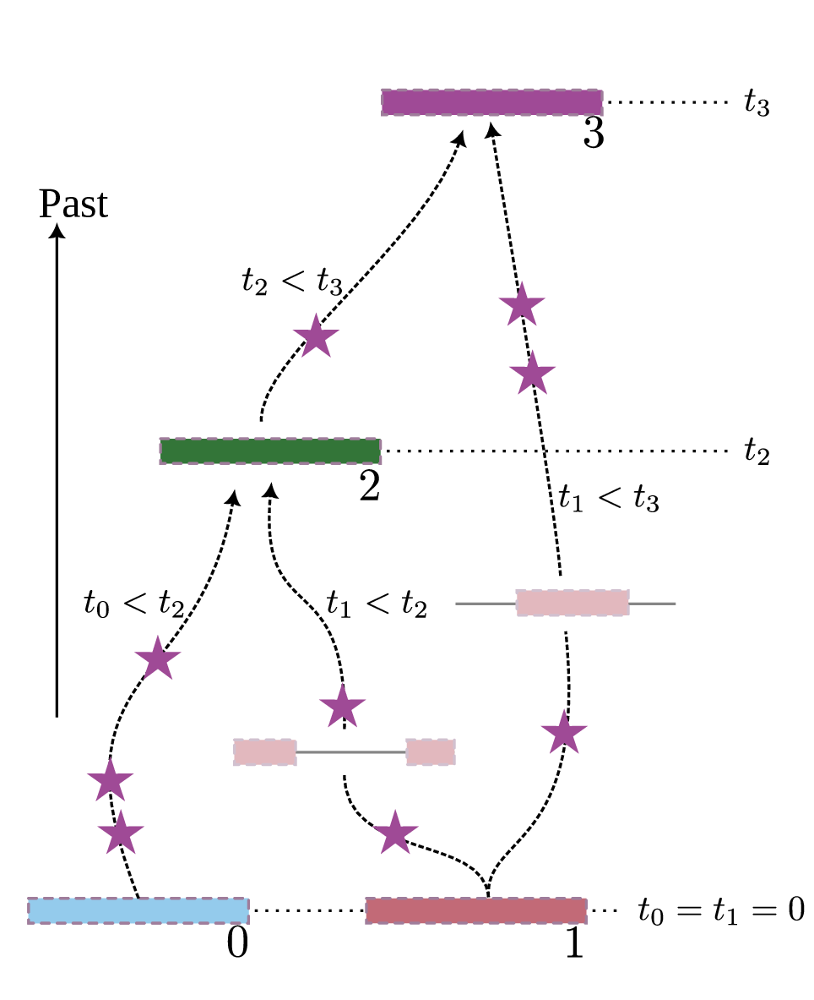
:::

::::

:::::::
:::

## Dating an ARG

::: columns
::::::: {.column width=50%}

*Goal:* find $\{t_i\}$

*The model:*
with mutation rate $\mu$, edge span $s_{ij}$:
$$y_{ij} \sim \text{Poisson}(\mu s_{ij} (t_j - t_i) )$$

::: fragment
*The MLE:* minimize
$$\begin{aligned}&\sum_{ij \in \mathcal{E}} \mu s_{ij} (t_j - t_j) \\&\qquad{}- y_{ij} \log\left(\mu s_{ij} (t_j - t_j)\right)\end{aligned}$$
subject to $\{t_i < t_j : i \to j \in \mathcal{E}\}$
:::

:::::::
::::::: {.column width=50%}

:::::::
:::

## But, what about uncertainty?

::: columns
::::::: {.column width=50%}

*New goal*: infer $t = \{t_i\}$, but Bayesian

::: incremental

- Given a prior $p(t)$,

- the per-edge likelihood is
$$p(y_{ij}|t_i-t_j) \propto (t_j - t_j)^{y_{ij}} e^{-\mu s_{ij} (t_i - t_j)}$$

- the full likelihood is
$$p(t,y) = p(t) \prod_{ij} p(y_{ij}|t_i - t_j)$$

- and so the marginal posterior on $t_i$ is
$$p(t_i|y) = \frac{\int p(t,y) dt_{\setminus i}}{\int p(t,y) dt}$$

- but, those integrals are rather difficult.

:::

:::::::
::::::: {.column width=50%}

::: floatright
{width=120%}
:::

:::::::
:::

## Variational approximation

::: columns
::::::: {.column width=70%}

- Approximate posterior marginals
    by Gamma distribution

- Fit by matching moments

- Result (hopefully) has exact marginal moments
    but ignores dependence in posterior

:::::::
::::::: {.column width=70%}

::: r-stack

:::: fragment

::::

:::: fragment

::::

:::: fragment
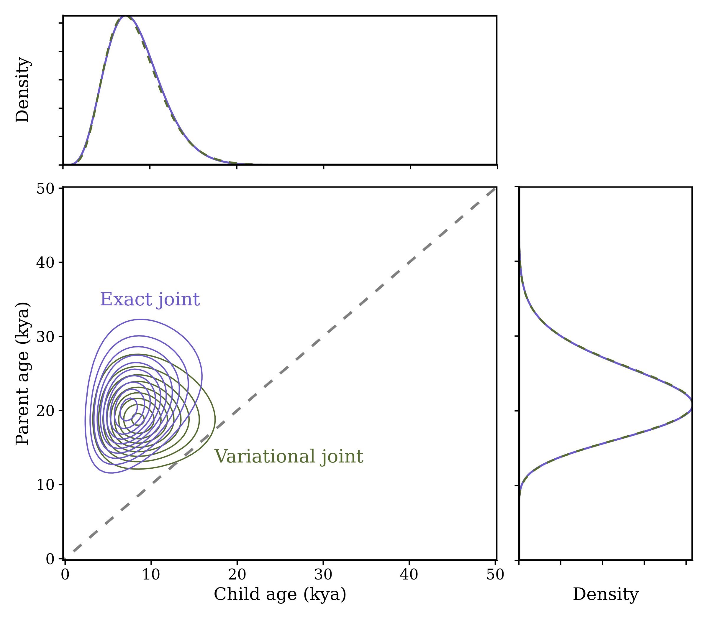
::::

:::

::::::: 
::: 

<!--
## Expectation propagation

factor variational posterior
into edge terms (like true posterior)

then do iterative refinement of edge contributions

that reduces to adjusting moments for $i$ and $j$
thanks to exponential family magic

and some serious computational magic
-->

## Some assembly required

::: columns
::::::: {.column width=70%}

- Fit by expectation propagation,
- requiring efficient stable computation of ${}_2F_1(a,b;c;z)$.

Additional magic:

- ambiguous singleton phasing
- better prior on root ages
- "recalibration" of times to enforce molecular clock

:::::::
::::::: {.column width=70%}

::::::: 
::: 

## Validation: simulation {data-background-image="figs/folks/yan_wong.jpg" data-background-position="bottom 50px right 50px" data-background-size=10%}

::: r-stack

:::: fragment
{width=70%}
::::

:::: fragment
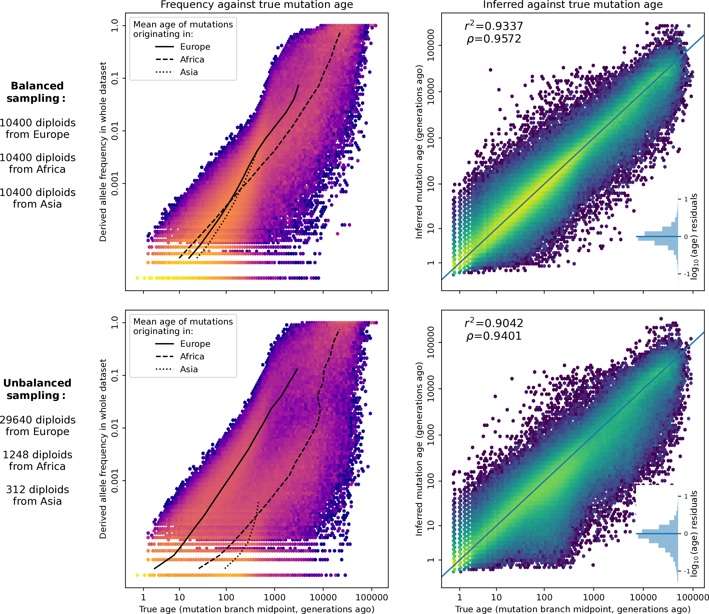{width=70%}
::::

:::

## Validation: real data {data-background-image="figs/folks/yan_wong.jpg" data-background-position="bottom 50px right 50px" data-background-size=10%}

# Back to the data

## {data-background-image="figs/folks/ben_jeffery.jpg" data-background-position="bottom 50px right 50px" data-background-size=10%}

We built the world’s largest whole-chromosome tree sequence from the phased 100,000 Genomes Project (aggV2) dataset.

5,680,570 hypothetical ancestors along chromosome 17
(as an example). ~870Mb.

## ADAC

Age Divergence at Allele Count (ADAC) quantifies (as an odds ratio) the probability that a given mutation is older than expected relative to some reference set of mutations at the same frequency in the data

::: r-stack

::: fragment

:::

::: fragment

:::

:::

## Deleterious variants are enriched in recent times

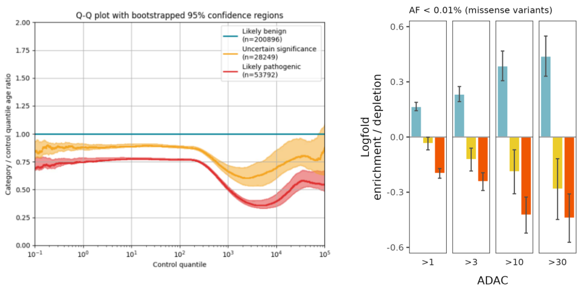

-------

-----------

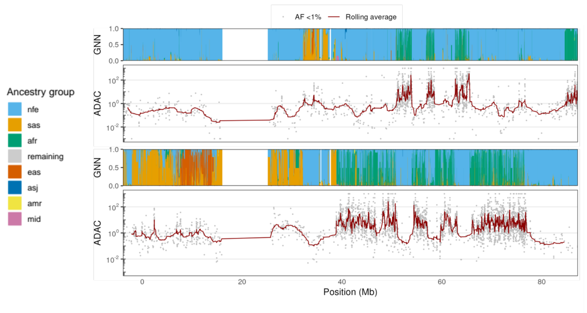

## Conclusions

- Mutations may be rare because they are recent
    or just because the individual's ancestry is not well-represented in the data.

- ARGs capture the complex and continuous nature of human genetic ancestry. 

- Mutations' age estimation reflects this uncertainty (at single locus resolution). 

- ARG inference and variant dating methods that work well with
    large, heterogeneous, and unbalanced biobanks
    can provide valuable insights into genetic variation
    without the need for discrete categorizations.

# Wrap-up

## Software development goals

::: {.columns}
:::::: {.column width=50%}

- open
- welcoming and supportive
- reproducible and well-tested
- backwards compatible
- well-documented
- capacity building

::: {.centered}
{width=35%}
:::

[PopSim Consortium](https://popsim-consortium.github.io/stdpopsim-docs/stable/index.html)

:::
:::::: {.column width=50%}

::: {.centered}
{width=60%}

[tskit.dev](https://tskit.dev)

{width=80%}
:::

:::
::::::

## Thanks!

:::: {.columns}
:::::::: {.column width=40%}

- Andy Kern
- Nate Pope
- Victoria Caudill
- Murillo Rodrigues 
- Gilia Patterson
- Chris Smith
- Thomas Forest
- Jiseon Min
- Clara Rehmann
- Anastasia Teterina
- Angel Rivera-Colon
<!--
- Bruce Edelman
- Matt Lukac
- Saurabh Belsare
- Gabby Coffing
- Jeff Adrion
- CJ Battey
- Jared Galloway
-->
- the rest of [the Co-Lab](https://kr-colab.github.io/people)

Funding:

- NIH NIGMS
- NSF DBI

::::
:::::::: {.column width=60%}

:::::::::: {.columns}
::::::::::::: {.column width=30%}

- Jerome Kelleher
- Ben Haller
- Yan Wong
- Ben Jeffery
- Sam Tallman
- Duncan Mbuli-Robertson
- Hanbin Lee
- Gregor Gorjanc
- Elsie Chevy
- Madeline Chase
- Sean Stankowski
- Matt Streisfeld
<!--
- Georgia Tsambos
- Jaime Ashander
- Jared Galloway
- Gideon Bradburd
- Bill Cresko
- Alison Etheridge
- Evan McCartney-Melstad
- Brad Shaffer
-->

:::::::::::::
::::::::::::: {.column width=30%}

:::::::::::::
::::::::::

{width=80%}

::::
::::::::

## {data-background-image="figs/guillemots_thanks.png" data-background-position=center data-background-size=50%}
